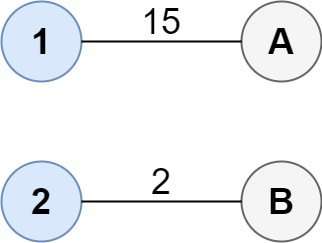
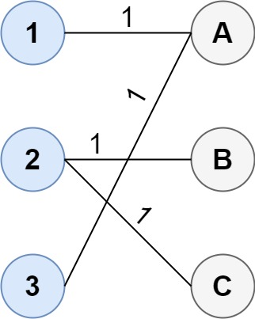

1595\. Minimum Cost to Connect Two Groups of Points

Hard

You are given two groups of points where the first group has <code>size1</code> points, the second group has <code>size2</code> points, and <code>size1 >= size2</code>.

The `cost` of the connection between any two points are given in an <code>size1 x size2</code> matrix where `cost[i][j]` is the cost of connecting point `i` of the first group and point `j` of the second group. The groups are connected if **each point in both groups is connected to one or more points in the opposite group**. In other words, each point in the first group must be connected to at least one point in the second group, and each point in the second group must be connected to at least one point in the first group.

Return _the minimum cost it takes to connect the two groups_.

**Example 1:**

**Input:** cost = [[15, 96], [36, 2]]

**Output:** 17

**Explanation:** The optimal way of connecting the groups is:

1--A

2--B

This results in a total cost of 17.

**Example 2:**

**Input:** cost = [[1, 3, 5], [4, 1, 1], [1, 5, 3]]

**Output:** 4

**Explanation:** The optimal way of connecting the groups is:

1--A

2--B

2--C

3--A

This results in a total cost of 4.

Note that there are multiple points connected to point 2 in the first group and point A in the second group.

This does not matter as there is no limit to the number of points that can be connected. We only care about the minimum total cost.

**Example 3:**

**Input:** cost = [[2, 5, 1], [3, 4, 7], [8, 1, 2], [6, 2, 4], [3, 8, 8]]

**Output:** 10

**Constraints:**

*   <code>size1 == cost.length</code>
*   <code>size2 == cost[i].length</code>
*   <code>1 <= size1, size2 <= 12</code>
*   <code>size1 >= size2</code>
*   `0 <= cost[i][j] <= 100`