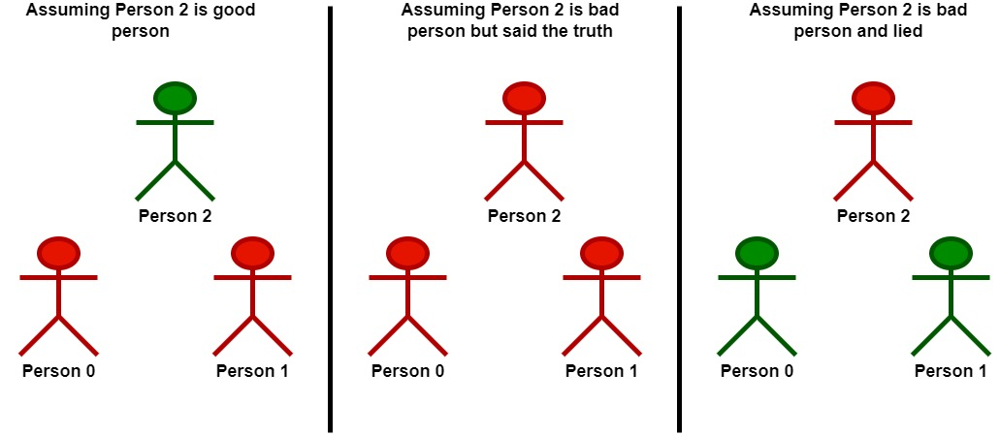
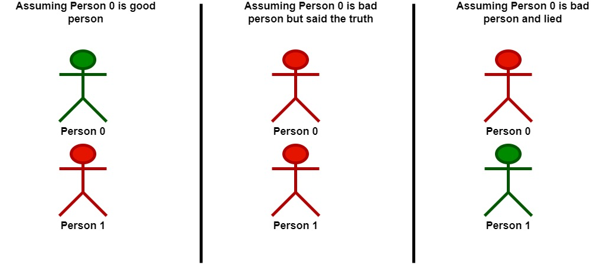

2151\. Maximum Good People Based on Statements

Hard

There are two types of persons:

*   The **good person**: The person who always tells the truth.
*   The **bad person**: The person who might tell the truth and might lie.

You are given a **0-indexed** 2D integer array `statements` of size `n x n` that represents the statements made by `n` people about each other. More specifically, `statements[i][j]` could be one of the following:

*   `0` which represents a statement made by person `i` that person `j` is a **bad** person.
*   `1` which represents a statement made by person `i` that person `j` is a **good** person.
*   `2` represents that **no statement** is made by person `i` about person `j`.

Additionally, no person ever makes a statement about themselves. Formally, we have that `statements[i][i] = 2` for all `0 <= i < n`.

Return _the **maximum** number of people who can be **good** based on the statements made by the_ `n` _people_.

**Example 1:**

**Input:** statements = [[2,1,2],[1,2,2],[2,0,2]]

**Output:** 2

**Explanation:**

    Each person makes a single statement.
    - Person 0 states that person 1 is good.
    - Person 1 states that person 0 is good.
    - Person 2 states that person 1 is bad.
    Let's take person 2 as the key.
    - Assuming that person 2 is a good person:
        - Based on the statement made by person 2, person 1 is a bad person.
        - Now we know for sure that person 1 is bad and person 2 is good.
        - Based on the statement made by person 1, and since person 1 is bad, they could be:
            - telling the truth. There will be a contradiction in this case and this assumption is invalid.
            - lying. In this case, person 0 is also a bad person and lied in their statement.
        - Following that person 2 is a good person, there will be only one good person in the group.
    - Assuming that person 2 is a bad person:
        - Based on the statement made by person 2, and since person 2 is bad, they could be:
            - telling the truth. Following this scenario, person 0 and 1 are both bad as explained before.
                - Following that person 2 is bad but told the truth, there will be no good persons in the group.
            - lying. In this case person 1 is a good person.
                - Since person 1 is a good person, person 0 is also a good person.
                - Following that person 2 is bad and lied, there will be two good persons in the group.
                
    We can see that at most 2 persons are good in the best case, so we return 2.
    Note that there is more than one way to arrive at this conclusion. 

**Example 2:**

**Input:** statements = [[2,0],[0,2]]

**Output:** 1

**Explanation:**

    Each person makes a single statement.
    - Person 0 states that person 1 is bad.
    - Person 1 states that person 0 is bad.
    Let's take person 0 as the key.
    - Assuming that person 0 is a good person:
        - Based on the statement made by person 0, person 1 is a bad person and was lying.
        - Following that person 0 is a good person, there will be only one good person in the group.
    - Assuming that person 0 is a bad person:
        - Based on the statement made by person 0, and since person 0 is bad, they could be:
            - telling the truth. Following this scenario, person 0 and 1 are both bad.
                - Following that person 0 is bad but told the truth, there will be no good persons in the group.
            - lying. In this case person 1 is a good person.
                - Following that person 0 is bad and lied, there will be only one good person in the group.
    We can see that at most, one person is good in the best case, so we return 1.
    Note that there is more than one way to arrive at this conclusion. 

**Constraints:**

*   `n == statements.length == statements[i].length`
*   `2 <= n <= 15`
*   `statements[i][j]` is either `0`, `1`, or `2`.
*   `statements[i][i] == 2`